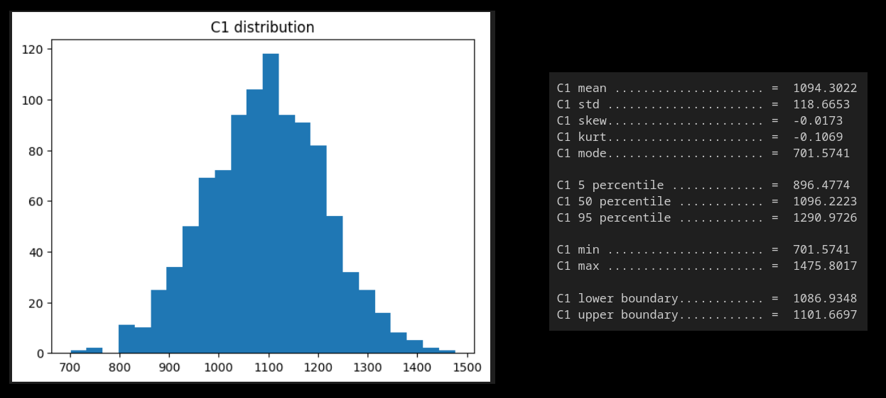

# Monte Carlo Simulations

This notebook shows how to implement Monte Carlo simulations to evaluate a portfolio in 3 different situations.

1. Only 1 asset over 1 year
2. Only 1 asset over 30 years
3. 2 correlated assets over 30 years

We're only interested in simulating the returns of the assets.

The output consists in the distribution of the final value of the portfolio and its descriptive statistics.

NB: we don't keep track of the seeds, so the outpout will change from one run to the next.

***
#### Output for each situation
***

***

***

